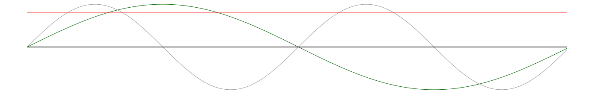

# non euclidean game stuff

So, some relatively famous games, like anti chamber, have played
with the idea of non euclidean space. Meaning, they show the player
a regular 3d world, but the math that's going on and the geometry
does not make "normal sense".

For example, normally if you do one full rotation around your axis,
you are in the same place as before.

Think of it as your view going around in a circle. The final view
is the same as the initial view.

Non euclidean space can violate this, by introducing an additional variable
to use for "space" that will be slowly change as you spin and will
be a different value after one rotation.

More recently, "Control" did a very short segment where something
similar happens, you do a small lap through a building, by following
a corridor, the corridor loops, and let's you "exit" the "loop",
where there was previously a wall on your first "rotation".

So generally this effect can be achieved in two approaches:

A variable keeping track of this higher space dimension can be 
saved in the character and the change in geometry can be caused by 
rotation of the character, 

the variable can be changed by some other kind of rotation or movement,
of the character relative to another point.

The thing that's really relevant is that there is some action or movement
that is "valid" in 3d space, but also continously changes another variable
on from one definite state to another definite state.

# math

So you have a value of your normal rotation of your character in grey,
and you have a "non euclidean" curve in green.

The idea is that whatever "spooky" thing you want to happen,
should only happen when the green curve is above a certain value.

Like 0, which will be the case for the first rotation, but NOT the second,
but then again the third.

More complicated setups require more math, but work the same way.

Like taking into account the angular position of a camera relative to an object.

# ralph demo

I've taken the roaming ralph demo from panda3d and modified it. The parts
that are like the original code are under pandas license

https://github.com/panda3d/panda3d/blob/master/LICENSE

https://github.com/panda3d/panda3d/
https://github.com/panda3d/panda3d/tree/master/samples/roaming-ralph

But I added three functions:

 * one function to initialize a new object and a non_euclidean task
 * the non euclidean task to check the rotation and turn a demonstration object "on" or "off"
 * one function to help calculate angular positions
 
These functions as well as the gltf demonstration object, which are mine, are licensed as MIT.

If you rotate ralph, the demonstration object will disappear on every
second rotation.
